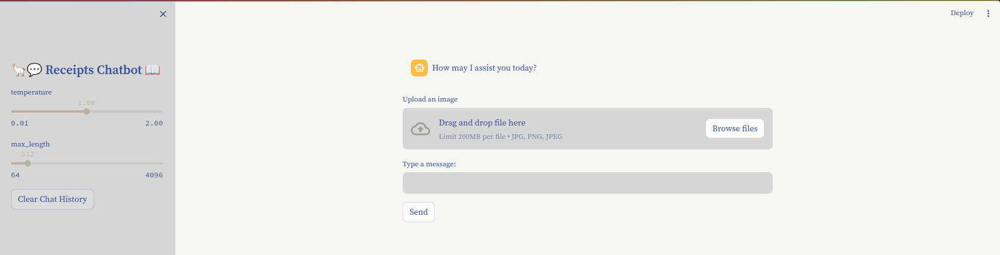

# 💬 Receipts_VQA 📖

## Introduce

In this project, We will using LLMs LLaVA and RAG to build a VQA Chatbot.

## Overview of the app

<div align="center"></div>

## Installation and Requirements

<!-- [ABSTRACT] -->

1. Clone project:

```shell
git clone ...
cd Receipts_VQA/
```

2. Create conda environments:

```shell
conda create --name <ENV_NAME> python=3.11 -y
conda activate <ENV_NAME>
```

3. Install [torch](https://pytorch.org/)

4. Run this command to install dependenies in the requirements.txt file

```shell
pip install -r requirements.txt
```

## Install LLaVA model from Ollama

First, we need install ollama 

```shell
curl -fsSL https://ollama.com/install.sh | sh
```

To use LLaVA model, we need to pull model from ollama 

```shell
ollama pull llava:7b-v1.6-mistral-q6_K
```

## Run Project

1. Run the streamlit server

``` shell
streamlit run app.py
```

2. Access the application in your browser at [http://localhost:8501].

3. Start chatting with the assistant!

## How it works
The app as follows:

1. The user enters an image in the upload image field.

2. User enters a question about uploaded image.

2. User messages are sent to the OCR and LLaVA model for processing.

3. The user's input, along with the chat history, is used to generate a response.

4. The LLaVA model generates a response based on the patterns it learned during training.
